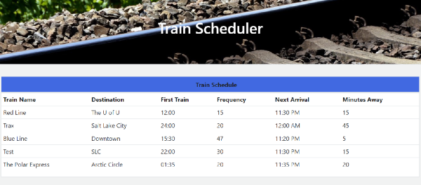
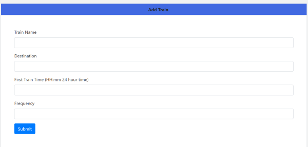

# Train-Scheduler

Train Scheduler demonstartes the usage of a real time database.  Utilizing Firebase, new train schedules can be added by completing the input form.  Upon clicking the submit button, the data in real time, updates in the chart.

## Built with 

* Javascript
* Firebase
* HTML
* CSS

## Image Credit

Image by <a href="https://pixabay.com/users/annca-1564471/?utm_source=link-attribution&amp;utm_medium=referral&amp;utm_campaign=image&amp;utm_content=2476467">annca</a> from <a href="https://pixabay.com/?utm_source=link-attribution&amp;utm_medium=referral&amp;utm_campaign=image&amp;utm_content=2476467">Pixabay</a>
